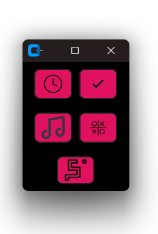

Demo Video: https://drive.google.com/drive/folders/1INOynZK3NryoVTDWkUk5BdtPwjCBOFax?usp=sharing

<a name="readme-top"></a>

<br />
<div align="center">
    


  <h3 align="center">Pandorable: Hack Your Wellness</h3>

  
  </p>
</div>


<!-- TABLE OF CONTENTS -->
<details>
  <summary>Table of Contents</summary>
  <ol>
    <li>
      <a href="#about-the-project">About The Project</a>
      <ul>
        <li><a href="#built-with">Built With</a></li>
      </ul>
    </li>
    <li>
      <a href="#getting-started">Getting Started</a>
      <ul>
        <li><a href="#prerequisites">Prerequisites</a></li>
      </ul>
    </li>
    <li><a href="#usage">Usage</a></li>
    <li><a href="#contributing">Contributing</a></li>
    <li><a href="#acknowledgments">Acknowledgments</a></li>
  </ol>
</details>


<!-- ABOUT THE PROJECT -->
# **About The Project**


# Feeling overwhelmed by your digital life? Enter Pandorable!

Pandorable, your adorable panda companion designed to simplify your day, offers a delightful blend of intuitive features and helpful functionalities built with Python's **tkinter** library for a user-friendly graphical interface. But Pandorable goes beyond the basics! 

**Here's how Pandorable works:**

- **Enhanced GUI:**  Pandorable utilizes a custom tkinter library to create a visually appealing and user-friendly interface that goes beyond the standard look and feel. 

<div align="center">
    
</div>


- **Advanced Gaze Detection:**  Leveraging the power of **MediaPipe** and **OpenCV**, Pandorable keeps an eye on your privacy. This advanced gaze detection system utilizes your computer's webcam to identify when someone approaches your screen. When someone else is looking into user's laptop, Pandorable alerts you with a spooked panda indicator, allowing you to discreetly protect your privacy.

- **Effortless Image Handling:** Pandorable seamlessly integrates the **Pillow** library for efficient management of image files, ensuring smooth operation and a visually pleasing experience.

**Pandorable's Features:**

- Built-in Break Reminders: Don't let screen fatigue take over! Pandorable gently reminds you to take breaks and offers relaxing activities to keep your mind and body refreshed. From mindful exercises to calming music suggestions curated by a built-in Lofi music player, Pandorable prioritizes your well-being.
<br>
<div align="center">
    
</div>


- Customizable Toolbar:  Access a variety of features with a simple keyboard shortcut (Ctrl+Shift+H). This handy toolbar puts you in control, offering:

    - Relaxing Games: Take a break and unwind with a selection of casual games designed to de-stress and rejuvenate.
    - To-Do List: Stay organized and manage your tasks with a built-in to-do list, ensuring you stay on top of your goals.

**- Easy Toggling:**  The same keyboard shortcut (Ctrl+Shift+H) acts as a toggle for the entire application. Launch the gaze detector, access the toolbar, and close everything again with this convenient combination.

<div align="center">
    
</div>

Pandorable is your one-stop shop for a balanced and enjoyable digital life. Let this adorable panda companion streamline your day and prioritize your well-being!


<p align="right">(<a href="#readme-top">back to top</a>)</p>


### Built With

* Python
* Tkinter
* Custom Tkinter
* Mediapipe
* OpenCV
* Pillow

<p align="right">(<a href="#readme-top">back to top</a>)</p>


<!-- GETTING STARTED -->
## Getting Started


To get a local copy up and running follow these simple example steps.

### Prerequisites

The list of requirements to run this project are listed in requirements.txt and here is how you can install them all:

  ```sh
  pip install -r requirements.txt
  ```


<!-- USAGE EXAMPLES -->
## Usage

1. Clone the repo
   ```sh
   git clone https://github.com/ArshiaAdhya/Pandorable.git
   ```
2. CD to Pandorable
3. Launch the launcher.py
4. The default shortcut key combo to toggle between windows is Ctrl+Shift+H.
<p align="right">(<a href="#readme-top">back to top</a>)</p>


<!-- CONTRIBUTING -->
## Contributing

Contributions are what make the open source community such an amazing place to learn, inspire, and create. Any contributions you make are **greatly appreciated**.

If you have a suggestion that would make this better, please fork the repo and create a pull request. You can also simply open an issue with the tag "enhancement".
Don't forget to give the project a star! Thanks again!

1. Fork the Project
2. Create your Feature Branch (`git checkout -b feature/AmazingFeature`)
3. Commit your Changes (`git commit -m 'Add some AmazingFeature'`)
4. Push to the Branch (`git push origin feature/AmazingFeature`)
5. Open a Pull Request

<p align="right">(<a href="#readme-top">back to top</a>)</p>


<!-- LICENSE -->


<!-- CONTACT -->


<!-- ACKNOWLEDGMENTS -->
## Acknowledgments


* This project was Team HackMasters submission for HackOFiesta v5 which was built in 36 hours for AI/ML Track.


<p align="right">(<a href="#readme-top">back to top</a>)</p>


